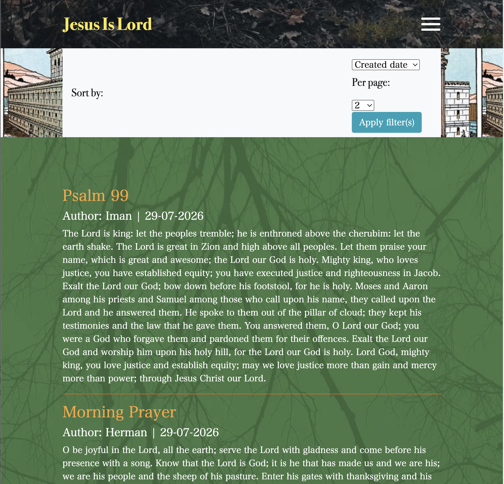

# Christian Blog Platform (Spring Boot & Spring Security)

A full-stack content management system built with Spring Boot, featuring 

• Role-based access control (Spring Security)

• Database relationships (Jakarta Persistence)

• Automated email delivery (`JavaMailSender`)

• REST endpoints (Spring Web)

• Custom user avatar resource uploads (`WebMvcConfigurer`)